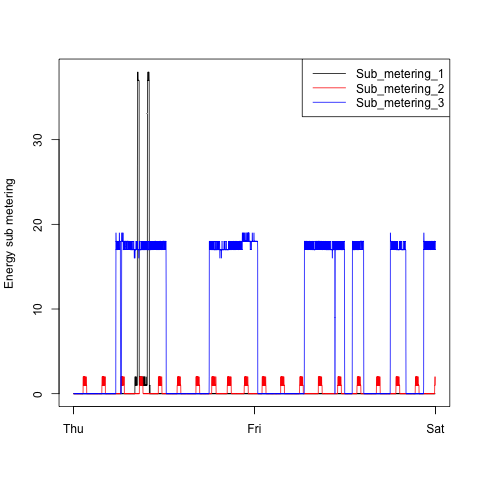
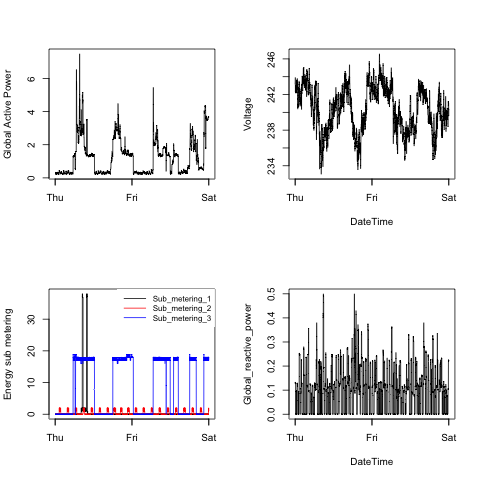

## Introduction

This is **Dale Wickizer's README.md** file for **Project 1** of **Exploratory Data Analysis** course. 

Information about the data used can be found in the associated **CodeBook.md** file.

## Program Execution

	source ("generatePlots.R")
	
	generatePlots ()

* **Assumption:**  The input dataset from UCI, **household\_power\_consumption.txt** is assumed to be unzipped and located in the same directory as the generatePlots.R file and the other .R code files.

## Design Considerations

##### Reading in the Data

A quick calculation showed that 2,075,259 rows x 9 columns x 8 bytes/element (assuming double precision real numbers) would result in **142.5 MiB**.  For safety, it is usually a good idea to double that number; so we would be looking at **285 MiB**, which would fit easily in the 8 GB of RAM I have on my Mac.  However, just because you CAN do something, doesn't mean you SHOULD.

In this case, we are only interested in two days of data out of 4 years worth. Increasingly, in the real world, datasets are HUGE (often multiple TiB in size). When analytically searching for the proverbial "needle" in the "haystack", it is not practical to load the whole "haystack" into memory.  Therefore, even though I had plenty of memory on my Mac, I decided it would be worthwhile to investigate the harder problem: Extracting only the data I needed and cleanng that up.
There were a number approaches I considered:

* Using "while" or "for" loops, to examine every record and extract only those rows that fell between midnight on 02/01/2007 and 23:59 on 02/02/2007.  Loops are generally calculationally expensive. Even on this modest dataset, reading through over 2 million rows would be slow.  

* A better approach is to leverage the multicore processors and use parallel computing when one can. In large environments, that is done using OpenMP and MPI, but obviously this is R, not C or Fortran 90, so that approach would be overkill here. 

* Another alternative would be to find the magical R package out there with a much smarter variant of "readLines" or "grep", which would allow you to identify the row indexes of the data of interest and only read those.  I was not able to find that...yet. This would be the ideal approach as it would be able to run on any operating system that supported R.

* The other approach would be to use either Unix tools or native C calls.  In the interest of time (since we had a short deadline), I choose to use the Unix tools (specfically, "grep"). The advantage of this approach is I could quickly create a working file of just the data I needed (2880 obs x 8 variables).  The drawback of this approach is that execution of this program would be limited to Unix systems.

##### Overall Program Design Trade-offs

* The instructions for the project stated: "Your code file should include code for reading the data so that the plot can be fully reproduced. You should also include the code that creates the PNG file."  Well, to me that was a little bit nebulous. One could take that to mean that a separate program was required for each plot and that program would include all the overhead to get and clean data as well. This, however, is very inefficient and is not best practice from a coding standpoint. Or, one could interpret "Your code file" to mean whatever code we wrote.  ***I decided take the latter interpretation and to follow coding best practices.***

* I created a separate function to extract and clean the data, make that data available to the four plotting functions I created, one per graph, and then have a single function call the others in the proper order. This approach was very efficient in that data was extracted and cleaned only once and the resulting clean data frame was passed to the other functions, making them very simple.

* The main function is called **generatePlots ()**.  It calls the 5 other functions, in this order:

	**readData ():**        
	
	_Extracts the portion of data we are interested in from the file ./household\_power\_consumption.txt and creates a small working file called **myPowerData.txt**.  That function also cleans the data, putting it the proper format and returns a data frame called **powerData** for use in the plotting functions_

	**plot1 (powerData):**  
	
	_Uses the powerData data frame and plots a histogram of Global Active Power (kilowatts) on the x-axis vs frequency (y-axis) to a bitmap file called **plot1.png**_

	**plot2 (powerData):**  
	
	_Uses the powerData data frame and plots a 2-dimensional graph of Global Active Data (y-axis) vs Date & Time, expressed as abbreviated days of the week (x-axis) both to a bitmap file called **plot2.png**_

	**plot3 (powerData):**  
	
	_Uses the powerData data frame and plots a 2-dimensional graph of Energy sub metering (y-axis) vs Data & Time, expressed as abbreviated days of the week (x-axis) to a bitmap file called **plot3.png**_

	**plot4 (powerData):**  
	
	_Uses the powerData data frame and plots a 2 x 2 grid of four 2-dimensional plots of date/time on the x-axis vs Global Active Power (upper left), Energy sub metering (lower left), Voltage (upper right), and Global Reactive Power (lower right) on the y-axes. The graphs are saved to a bitmap file called **plot4.png**_
	

## Making Plots

Our overall goal here was simply to examine how household energy usage varies over a 2-day period in February, 2007. The following are the actual plots generated by source code in this directory, as directed. Each plot was stored in a PNG formatted bitmap file, 480 x 480 pixels in size, as required.  Each plot was named after the function that produced it, as required:

### Plot 1

 

### Plot 2

 

### Plot 3

 

### Plot 4

 

